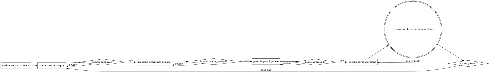

# Planning Work in Phases

## Overview

Router for the planning workflow. One job: take a goal from whatever source exists,
then drive it through the phases in order — **brainstorm → breakdown into phases →
one plan per phase → execute the plans → review the implementation** — handing off to the
matching phase skill at each step. Do not do the phase work here — gather, check, route, gate.

Each phase is its own delegatable skill. Between phases there is a **user approval
gate**: do not advance until the current phase's artifact is approved.

## When to Use

- "Plan this feature / epic", "break this down", "let's scope this out before building".
- Starting from a Jira / Linear ticket, a PRD, a plan doc, a brainstorm, or just a link.
- Before entering plan mode or writing code for a multi-step task.

Not for: a single trivial edit, or work already broken down with an approved plan in
hand (jump straight to execution).

## Step 0 — Gather the source of truth

Read every intent artifact available: the prompt, attached docs, spec, PRD, brainstorm
notes, plan doc. If given **only a link** (Jira / Linear / PRD / doc), pull its content:

- `WebFetch` the URL, or use an available Atlassian / Linear MCP (search deferred tools
  with `ToolSearch` for `jira` / `linear` / `atlassian`) to read the ticket or PRD.
- If it is unreachable (auth, private), ask the user to paste the content. Do not guess
  what a ticket says.

Extract: goal, scope, intended stack, constraints, success metrics, what "done" means.

**If the goal is a bug / incident / regression without a known root cause**, don't plan a fix
blind — **REQUIRED SUB-SKILL:** run `debugging-an-issue` first. It produces a committed diagnosis
doc (root cause + resolution approach + regression-test plan) that becomes the source of truth for
the phases below.

**If the goal is a security concern / audit**, **REQUIRED SUB-SKILL:** run
`finding-security-vulnerabilities` first. It produces a committed assessment doc (confirmed findings
+ remediation approach + security-test plan) that becomes the source of truth for the phases below.

## Superpowers check

The phase skills delegate to the `superpowers` plugin when it is present. Detect it once
here and note the result for the phases:

```bash
# installed on disk? (version-agnostic)
ls ~/.claude/plugins/cache/*/superpowers/*/skills/brainstorming/SKILL.md 2>/dev/null
# enabled?
grep -q '"superpowers@claude-plugins-official": true' ~/.claude/settings.json && echo enabled
```

Or run `claude plugin list`. `brainstorming` backs phase 1, `writing-plans` backs phase 3.
Each phase re-checks lightly (it can be invoked directly), so this is just a heads-up.

## The phases



Route in order — each is a mandatory hand-off, not optional:

1. Brainstorm → **REQUIRED SUB-SKILL:** use `brainstorming-a-goal`. Gate on the user
   approving the design doc.
2. Breakdown → **REQUIRED SUB-SKILL:** use `breaking-down-into-phases`. Gate on the user
   approving the breakdown.
3. Plan → **REQUIRED SUB-SKILL:** use `planning-each-phase`. Produces one plan per phase.
4. Execute → **REQUIRED SUB-SKILL:** use `executing-phase-plans`. Runs the plans one per
   phase in dependency order (worktree + subagent-or-inline choices made there).
5. Review → **REQUIRED SUB-SKILL:** use `reviewing-phase-implementation`. Agent review then
   user review (or fully autonomous) against the spec + plan; on approval marks the plan done
   and stamps progress. A spec gap here loops back to phase 1.

## Scale to size

Match the ceremony to the goal — do not force a heavy brainstorm onto a settled request:

- **Source already has a thorough design** (a detailed PRD, an approved spec) → phase 1 is
  a short **confirmation**, not a full Socratic brainstorm: summarize the design, fill gaps
  with a few targeted questions, produce/adopt the design doc, get approval. Every goal
  still gets a design doc and an approval — "too simple to need a design" is a trap; the
  design can just be short.
- **Small goal** → breakdown may collapse to a **single phase** → a single plan. Don't
  invent phases to look thorough.
- **Large / multi-subsystem goal** → the strength of this workflow: breakdown into N
  contextful phases, one plan each.

## Convention this workflow enforces

- **Artifact home:** `docs/plan/` — `specs/` (design docs), `breakdown/` (phase breakdowns),
  `phases/<N-slug>/plan.md` (one plan per phase). Same layout whether or not superpowers is
  installed.
- **Delegate when present, inline when absent:** phases 1 and 3 use the superpowers skill if
  available; otherwise they ask the user to install it or continue with a faithful inline
  fallback.
- **Approve before advancing:** never skip a phase's review gate.
