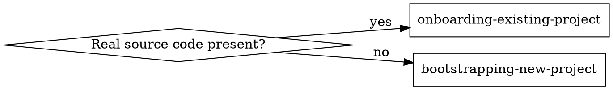

# Setting Up Claude in a Project

## Overview

Router for the initial Claude Code setup phase. One job: decide whether this is a
**new** or **existing** project, then hand off to the matching workflow skill. Do
not do the onboarding here — route.

Grounded in Anthropic's official large-codebase guidance:
https://claude.com/blog/how-claude-code-works-in-large-codebases-best-practices-and-where-to-start

## When to Use

- First-time Claude Code setup in a repo ("init this project", "set up Claude here").
- You are unsure whether to treat the project as greenfield or established.
- Before touching `CLAUDE.md` / `AGENTS.md` for setup purposes.

Not for: routine feature work in an already-onboarded repo.

## The one decision

**"Real source code" = anything beyond docs/config scaffolding:** source files
(`.ts`, `.py`, `.go`, …), a package manifest (`package.json`, `pyproject.toml`,
`go.mod`, `Cargo.toml`, …), a populated `src/`/`lib`/`app` tree, migrations, tests.

- **Existing** — real source is present (even if messy or partly documented).
- **New** — empty repo, or only specs/PRD/plan/brainstorm/README/`docs/`, no source
  yet.

How to check fast: `git ls-files | head`, or list the tree and grep for a manifest.
Edge case — a repo with only a `README` + PRD and no code is **new**. A repo with a
manifest but empty `src/` is **existing** (it declares a stack).

## Route

- Existing project → **REQUIRED SUB-SKILL:** use `onboarding-existing-project`.
- New project → **REQUIRED SUB-SKILL:** use `bootstrapping-new-project`.

If genuinely ambiguous, ask the user one question: "Is there already source code to
build on, or are we starting from a spec/plan?" — then route on the answer.

## Convention this setup enforces

`CLAUDE.md` is the **canonical** context file. `AGENTS.md` is a **symlink** to
`CLAUDE.md` (`ln -s CLAUDE.md AGENTS.md`), so every agent tool reads one source of
truth. Both sub-skills follow this, and both also handle **project memory**
(`memory.md` / `MEMORY.md` + `.claude/memory/`): existing → verify it matches code and
propose fixes; new → seed it from intent.
