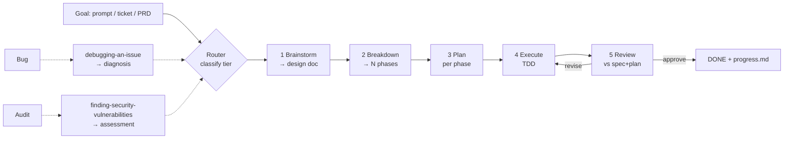
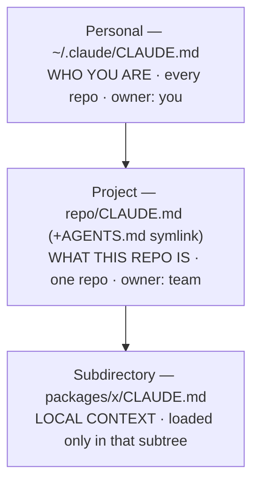

# Claude Boilerplate — Workflow Rationale & Benchmark Report

> **Why** the `claude-boilerplate` plugin is built the way it is — the workflow, agents, skills,
> tools/plugins/MCP, and layered `CLAUDE.md` — plus **measured benchmarks** for each layer.
> Audience: engineers & tech leads. For install/usage see `README.md`.

---

## 1. Executive summary

A raw Claude Code checkout is powerful but **ungoverned**: no enforced order, no quality gate, no
memory of your standards. `claude-boilerplate` turns it into a **governed delivery pipeline** —
*brainstorm → breakdown → plan → execute → review* — run by specialist subagents, with deterministic
hooks, live-doc MCP servers, and a layered `CLAUDE.md`.

> **Thesis: discipline is enforced by structure, not by hope.** The model doesn't have to *remember*
> to test, check docs, review for security, or stop over-engineering — the workflow makes those the
> path of least resistance.

The **complexity tier** keeps this from becoming bureaucracy: every goal is classified
(Trivial / Small / Standard / Large + risk flag) and ceremony scales to it — while the quality bar
(≥95% coverage, security on risk, E2E before done, spec↔code traceability) stays constant.

| Layer | Count | What it is |
|---|---|---|
| Skills | **29** | Reusable, on-demand expertise + workflow rubrics |
| Subagents | **18** | Specialized workers dispatched per phase |
| Hooks | **3** | Deterministic, always-on session automation |
| Core MCP | **3** | context7, playwright, shadcn (keyless, auto-loaded) |
| Optional MCP | **3** | figma, sentry, github (auth-gated, opt-in) |
| Companions | **2** + 1 CLI | superpowers, ponytail, + rtk |

*(Verified: `skills/`=29, `agents/*.md`=18, `hooks/*.sh`=3.)*

---

## 2. The problem it solves

Each layer is a countermeasure to a specific failure mode of ungoverned AI coding:

| Failure mode | Countermeasure |
|---|---|
| **Context rot** (loses the plot in long sessions) | Subagents (isolated windows) + `progress.md` + SessionStart hook |
| **Silent scope creep** | Phase breakdown + approval gates + spec non-goals + ponytail |
| **No quality gate** | Phase-5 review + ≥95% coverage + QA/E2E + security pass |
| **Guesswork over docs** | context7 MCP (live docs) + "never guess a dependency" rule |
| **One agent reviews its own work** | Read/write separation — reviewers can't approve their own code |
| **Standards amnesia** | Layered `CLAUDE.md` (personal + project + subdirectory) |
| **Over-engineering** | ponytail laziness ladder + "simplest structure" design rubrics |

---

## 3. Design philosophy

- **Workflow-as-discipline.** Staged and gated: no code before an approved plan, no plan before an
  approved design, no "done" before review. Front-loads cheap decisions before expensive rewrites.
- **Complexity tiers as a throttle.** A 5-line change shouldn't pay a subsystem's tax. The tier
  (set at router "Step 0.5") scales ceremony:

  | Tier | Phases | Design specialists | Execution | Gates |
  |---|---|---|---|---|
  | Trivial / Small | 1 | none (inline) | inline | single end gate |
  | Standard | few | only relevant, parallel | subagent-per-task | per-phase |
  | Large | many | full set, arch-first then parallel | subagent-driven, worktrees | per-phase/task |

  A **risk flag** (auth/crypto/payments/PII/uploads/external input) bumps ceremony up regardless of size.
- **Quality bar held constant** (never scales down): ≥95% coverage on touched files · security review
  on risk-flagged changes (Critical blocks) · an E2E before done · spec↔code traceability.

Tiers cut *redundant repetition*, never the bar.

---

## 4. Why the workflow (5 phases + 2 on-ramps)

| Phase | Skill | Guarantee |
|---|---|---|
| Router | `planning-work-in-phases` | Every goal enters the same governed path, sized to tier |
| 1 Brainstorm | `brainstorming-a-goal` | Agreed spec (scope, non-goals, success criteria) before any code |
| 2 Breakdown | `breaking-down-into-phases` | Large work split into reviewable, resumable units |
| 3 Plan | `planning-each-phase` | Execution is mechanical (TDD, bite-sized, no placeholders) |
| 4 Execute | `executing-phase-plans` | Traceable, resumable build (committed `progress.md`) |
| 5 Review | `reviewing-phase-implementation` | Nothing "done" on the author's say-so |

- **Approval gates** stop a wrong direction cheaply; their *number* scales with tier but never
  disappears on a risk-flagged change.
- **On-ramps** start from a symptom, not a clean goal: `debugging-an-issue` /
  `finding-security-vulnerabilities` investigate first (root cause / confirmed vuln), emit a doc, and
  **feed the same pipeline** — so fixes are designed/planned/tested/reviewed, not hot-patched.

---

## 5. Why agents (subagents)

Eighteen specialists replace "one thread does everything," for five reasons:

1. **Context isolation** — each runs in its own window; a deep search returns a compact answer, so the
   main thread stays lean. The biggest defense against context rot.
2. **Specialization** — one craft skill each; focused prompts beat a generalist.
3. **Parallelism** — design specialists advise concurrently; backend/frontend build simultaneously
   against a frozen contract.
4. **Read/write separation** — advisors & reviewers are read-only; only executors + qa-tester write.
   A reviewer *can't* rubber-stamp its own code because it never wrote any.
5. **Model tiering = cost lever** — opus for reasoning (plan/design/review/debug), sonnet for execution.

| Agent | Phase | Access | Model | Role |
|---|---|---|---|---|
| `research-agent` | any | read-only | opus | Web/docs research, cited |
| `explorer-agent` | any | read-only | opus | Locate/trace/map code (`file:line`) |
| `debugger-agent` | pre-plan | doc+test | opus | Root-cause → diagnosis + repro |
| `brainstorm-agent` | 1 | docs | opus | Divergent: options + direction |
| `spec-author-agent` | 1 | spec | opus | Convergent: direction → design doc |
| `plan-writer-agent` | 1/3 | plan | opus | Spec+breakdown → per-phase plan |
| `design-reviewer-agent` | 1 | read-only | opus | Adversarial spec/plan gate |
| `architecture-agent` | 1 | read-only | opus | Structure, boundaries, tech choices |
| `api-designer-agent` | 1 | read-only | opus | API contract → frozen artifact |
| `database-designer-agent` | 1 | read-only | opus | Data model, keys, migration |
| `frontend-designer-agent` | 1 | read-only | opus | Component tree, state, a11y |
| `backend-executor` | 4 | write | sonnet | Server code, TDD |
| `frontend-executor` | 4 | write | sonnet | UI, async states, a11y |
| `database-executor` | 4 | write | sonnet | Safe/reversible migrations |
| `devops-executor` | 4 | write | sonnet | CI/CD/IaC, validate-first |
| `qa-tester` | 4/5 | tests | sonnet | Black-box test the running app |
| `code-reviewer-agent` | 5 | read-only | opus | Review built code (dims 1–6) |
| `security-reviewer-agent` | 5 | read-only | opus | Pentest/OWASP; Critical blocks |

Every agent is paired with a skill and "usable inline" — nothing hard-depends on dispatch.

---

## 6. Why skills (and not just `CLAUDE.md`)

A **skill** is reusable expertise loaded **only when relevant**. `CLAUDE.md` loads *every* turn (must
stay small); skills are **progressive disclosure** — full rubric pulled in only when doing that work,
zero cost otherwise.

| | `CLAUDE.md` | Skills |
|---|---|---|
| Loaded | Always | On demand |
| Cost | Permanent budget | Zero until invoked |
| Content | *What's true here* | *How to do a kind of work* |

Plus: **versioned craft rubrics** (improve once, every migration inherits it) and **delegation with
inline fallback** (uses `superpowers` when present, faithful inline copy when not — never hard-depends).

**The 29 skills:** Setup (3) · Personal (1) · Planning router+phases (6) · On-ramps (3) · Design
rubrics (5) · Execution craft (9, incl. cross-cutting auth/i18n/observability/documentation/
api-contract) · QA/testing (2). Full list in Appendix A.

---

## 7. Why hooks

**Deterministic, always-on automation** — things that must happen *every time* regardless of model
attention. A probabilistic model forgets; a hook doesn't.

| Hook | Event | Guarantees |
|---|---|---|
| `session-start-context.sh` | SessionStart | Resume with branch, uncommitted count, in-progress `progress.md`, contract state |
| `post-tooluse-format.sh` | PostToolUse (Write/Edit) | Edited file formatted by the *project's own* formatter (detected, not installed) |
| `stop-doc-sync.sh` | Stop | Reminder to sync `CLAUDE.md` if structure changed |

**Safety contract:** no deps, read-only except the edited file, **always exit 0** — a hook can never
break a session (silently no-ops when nothing applies). That's why it's safe to run them every event.

---

## 8. Why MCP servers

MCP gives the model **grounded capability it lacks** — the model can't run a browser or query a live
registry; MCP can.

**Core — keyless, auto-loaded** (`.mcp.json`):

| Server | Capability | Why |
|---|---|---|
| **context7** | Live library/SDK docs | Kills version guesswork — enforces "verify, don't guess" |
| **playwright** | Real browser | True E2E for `qa-tester` (journeys, async, a11y) |
| **shadcn** | Component registry | Frontend agents use *real* components, not invented ones |

**Optional — auth-gated, opt-in:** **figma** (OAuth, design context) · **sentry** (OAuth, errors/
traces) · **github** (PAT, PRs/issues/CI).

Two choices: **core-keyless vs optional-auth** (fresh install works instantly, no credential leaks);
**graceful degradation** (a missing server is skipped, never fails) — same setup runs solo or full-team.

---

## 9. Why the companion plugins & CLI

All **optional and fallback-safe** — the plugin's own skills work without them.

| Companion | Adds | Why |
|---|---|---|
| **superpowers** (plugin) | TDD/brainstorm/plan/debug/review methodology | Phase skills delegate to it when present; inline fallback when not |
| **ponytail** (plugin) | YAGNI "laziness ladder" each turn | Structural defense against over-engineering (never cuts validation/security/a11y) |
| **rtk** (CLI+hook) | Compresses 100+ dev-command outputs | Extends context-window life (`git status` → `rtk git status`) |

Pattern mirrors the whole design: **optional, detected-not-required, graceful fallback.**

---

## 10. Why layered `CLAUDE.md` (personal / project / subdirectory)

`CLAUDE.md` is the model's **always-on memory**. Layering exists because different truths have
different *scopes and owners*, and loading all of it everywhere would blow the context budget.

- **Personal** (`~/.claude/CLAUDE.md`) — identity, conventions, Definition of Done, guardrails.
  Travels with *you*; every project inherits your standards. Written via `personalizing-claude`.
- **Project** (`<repo>/CLAUDE.md`) — canonical, committed, shared repo truth. `AGENTS.md` symlinks to
  it (one source for every agent tool). Travels with the *code*.
- **Subdirectory** (`packages/x/CLAUDE.md`) — local context, loaded only when working in that subtree.
  Keeps the top file lean, avoids timeouts, keeps context proportional to the work.

**Precedence:** project + explicit request > personal > default. **Why it scales:** separation of
concerns · token budget (only relevant layers load) · team-vs-individual (project committed, personal
not) · layered loading (general → specific).

---

## 11. Benchmark

**Question.** Does a **cheap model running the workflow through subagents (haiku, derive→execute)** match
a **strong model answering one-shot (opus)**? Run **2026-07-20**, subagent-dispatched, **N=5/arm**,
scored by a **hidden Go `-race` grader neither arm ever saw** (re-run by the main thread, not
self-reported). A **haiku one-shot** arm is included to isolate the workflow's contribution.

**Task.** A per-user **rate-limited document vault** (Go) bundling four concerns in one contract —
`NewVault(limit, window, now) *Vault` · `Put(owner,docID,content)` · `Get(requester,docID)` — graded on
**12 edge properties**: access control (**IDOR**, ownership), validation (empty inputs), rate limit
(over-limit, per-requester isolation, denied-reads-don't-consume-quota), the **sliding-window boundary
both directions + partial eviction**, and concurrency (`-race`). The spec **left the boundary
unspecified** — each arm had to *derive* it. Every arm also wrote its **own test suite** (so tests
generated is comparable). The grader tests only unambiguous boundary behavior (strictly-inside counts,
strictly-outside expires), so the defensible `<`-vs-`≥` exact-instant choice is not graded as a defect.

### 11.1 Correctness — independent grader (12 edges × N=5 = 60 checks/arm)

| Arm | model · dispatch | samples 12/12 | grader edges | contract break |
|---|---|---|---|---|
| opus one-shot | opus · 1 agent | **5/5** | **60/60** | none |
| haiku one-shot | haiku · 1 agent | **5/5** | **60/60** | none |
| **haiku workflow (subagents)** | haiku · 2 agents (derive→execute) | **5/5** | **60/60** | none |

**A three-way tie on correctness.** The cheap model running the workflow through subagents passed
**every one of the 60 independent checks** — IDOR, the derived sliding-window boundary (both sides),
partial eviction, concurrency `-race` — identical to opus one-shot, at a fraction of the per-token
price. **No contract break this run** — all 5 workflow executors kept `NewVault(...) *Vault` (the
"signatures-frozen" fix from the prior run held).

### 11.2 Total test cases generated — passed / failed

Each arm authored its own suite; run independently (isolated), the totals:

| Arm | test funcs generated | **passed** | **failed** | grader edge-checks (pass/fail) |
|---|---|---|---|---|
| opus one-shot | 75 (13–17/sample) | **75** | **0** | 60 / 0 |
| haiku one-shot | 111 (19–25/sample) | **111** | **0** | 60 / 0 |
| **haiku workflow (subagents)** | **135** (26–28/sample) | **135** | **0** | 60 / 0 |
| **Total** | **321** | **321** | **0** | 180 / 0 |

- **The workflow generates the most tests** — **135**, ~1.8× the opus one-shot's 75 — because each
  sample first writes a derivation (edge + security-abuse enumeration, boundary on worked numbers, a
  two-sided boundary test) that the executor turns into a suite. More enumerated edges → more tests.
- **All 321 generated tests pass on an isolated run; the grader confirms 180/180.** One nuance, kept
  honest: during the *high-load* parallel run (20 agents at once) one workflow sample's suite reported
  3 transient failures, but it passes **13/13 times in isolation** (8 full-suite `-race` + 5 targeted)
  — a CPU-starvation measurement artifact, not a reproducible defect. It still makes the standing
  point: **an arm's self-reported "all green" is not trustworthy on its own — only an independent
  re-run / grader is** (the core argument for read/write separation, §5).

### 11.3 Takeaways & limits

- **Cheap-model-with-workflow ties strong-model-one-shot on correctness** (60/60 vs 60/60) and ships
  **~1.8× the regression tests** — the workflow's durable output. Cost: ~2.5× the tokens (two haiku
  stages, ~103k vs ~43k) and more wall-clock, on a model that is far cheaper per token.
- **On a small, clearly-contracted task the workflow adds no *correctness* over a plain cheap one-shot**
  (both 60/60) — it adds the **test suite + edge/security analysis** and process consistency. This
  validates the tier-throttle (§3): reserve subagent ceremony for where coordination/scale pays.
- **The prior contract-break did not recur** — the frozen-signature guardrail + conformance self-check
  held across all 5 workflow executors.
- **Not established** (N=5, one single-contract task): the workflow's **coordination** value
  (multi-file, parallel tracks, cross-session, the phase-5 review gate actually running) and the
  security-checklist reliability of earlier runs (path-traversal 17%→0%). Measure your own messy,
  multi-file tasks before generalizing.

## Appendix A — Skills (29)

| Category | Skills |
|---|---|
| Setup | `setting-up-claude-in-a-project`, `bootstrapping-new-project`, `onboarding-existing-project` |
| Personal | `personalizing-claude` |
| Planning | `planning-work-in-phases`, `brainstorming-a-goal`, `breaking-down-into-phases`, `planning-each-phase`, `executing-phase-plans`, `reviewing-phase-implementation` |
| On-ramps | `debugging-an-issue`, `finding-security-vulnerabilities`, `researching-sources` |
| Design rubrics | `reviewing-specs-and-plans`, `designing-architecture`, `designing-an-api`, `designing-a-database`, `designing-a-frontend` |
| Execution craft | `implementing-backend`, `implementing-frontend`, `implementing-database-changes`, `implementing-devops`, `implementing-auth-and-authorization`, `implementing-i18n`, `implementing-observability`, `implementing-documentation`, `coordinating-api-contract` |
| QA / testing | `testing-apis`, `testing-ui-and-e2e` |

## Appendix B — Agents (18) · Hooks (3)

Agents: see §5. Hooks: see §7.

## Appendix C — Install scopes

| Scope | Enable-reference | Committed? | Who gets it |
|---|---|---|---|
| user | `~/.claude/settings.json` | n/a | you, every project |
| project · local-only | `.claude/settings.local.json` (gitignored) | no | just you, this repo |
| project · shared | `.claude/settings.json` | yes | all teammates on clone |

Plugin files are **cached, never copied into the repo** — only an enable-reference line is written.

---

*Internal learning & research report. Grounded in the repo (`CLAUDE.md`, `README.md`, `CHANGELOG.md`,
`skills/`·`agents/`·`hooks/`·`.mcp.json`) and a live benchmark run 2026-07-20 (N=5 per arm, hidden
`-race`-grader scored, subagent-dispatched). Numbers are directional over 5 samples, not a statistical
distribution — see §11.1–§11.3.*
