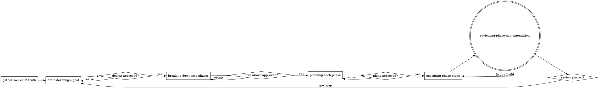

# Planning Work in Phases

## Overview

Router for the planning workflow: take a goal from whatever source exists and drive it through
**brainstorm → breakdown into phases → one plan per phase → execute → review**, handing off to the
matching phase skill at each step. Gather, check, route, gate — don't do the phase work here.

Each phase is its own delegatable skill, gated by user approval between phases — but **the
complexity tier sets how many gates fire** (Step 0.5): Small/autonomous collapses to a single end
gate, Large keeps every gate. Classify the tier before routing.

## When to Use

- "Plan this feature / epic", "break this down", "let's scope this out before building".
- Starting from a Jira / Linear ticket, a PRD, a plan doc, a brainstorm, or just a link.
- Before entering plan mode or writing code for a multi-step task.

Not for: a single trivial edit, or work already broken down with an approved plan in hand (jump
straight to execution).

## Step 0 — Gather the source of truth

Read every intent artifact available: prompt, attached docs, spec, PRD, brainstorm notes, plan
doc. If given **only a link** (Jira / Linear / PRD / doc), pull its content:

- `WebFetch` the URL, or an available Atlassian / Linear MCP (search deferred tools with
  `ToolSearch` for `jira` / `linear` / `atlassian`).
- Unreachable (auth, private) → ask the user to paste it. Never guess what a ticket says.

Extract: goal, scope, intended stack, constraints, success metrics, what "done" means.

**Bug / incident / regression with no known root cause** → don't plan a fix blind. **REQUIRED
SUB-SKILL:** run `debugging-an-issue` first — produces a committed diagnosis doc (root cause +
resolution approach + regression-test plan) that becomes the source of truth below.

**Security concern / audit** → **REQUIRED SUB-SKILL:** run `finding-security-vulnerabilities`
first — produces a committed assessment doc (confirmed findings + remediation approach +
security-test plan) that becomes the source of truth below.

## Superpowers check

The phase skills delegate to the `superpowers` plugin when present. Detect it once here and note
the result for the phases:

```bash
# installed on disk? (version-agnostic)
ls ~/.claude/plugins/cache/*/superpowers/*/skills/brainstorming/SKILL.md 2>/dev/null
# enabled?
grep -q '"superpowers@claude-plugins-official": true' ~/.claude/settings.json && echo enabled
```

Or `claude plugin list`. `brainstorming` backs phase 1, `writing-plans` backs phase 3. Each phase
re-checks lightly (it can be invoked directly) — this is just a heads-up.

## The phases



Route in order — each is a mandatory hand-off, not optional:

1. Brainstorm → **REQUIRED SUB-SKILL:** `brainstorming-a-goal`. Gate on the design doc approval.
2. Breakdown → **REQUIRED SUB-SKILL:** `breaking-down-into-phases`. Gate on breakdown approval.
3. Plan → **REQUIRED SUB-SKILL:** `planning-each-phase`. One plan per phase.
4. Execute → **REQUIRED SUB-SKILL:** `executing-phase-plans`. Runs plans one per phase in
   dependency order (worktree + subagent-or-inline choices made there).
5. Review → **REQUIRED SUB-SKILL:** `reviewing-phase-implementation`. Agent review then user
   review (or fully autonomous) vs spec + plan; approval marks the plan done and stamps progress.
   A spec gap here loops back to phase 1.

## Step 0.5 — Classify the complexity tier

**Before routing, size the goal and set its tier.** The tier throttles ceremony to the actual work
so a small feature doesn't pay large-feature overhead. State the tier and reasoning to the user,
then carry it through every phase (record it in the design doc header). **Every phase skill reads
this tier and adjusts** — not advisory.

Default heavy ceremony is the single biggest reason a small feature takes hours — right-sizing
here is the workflow's highest-leverage step.

| Tier | Trigger | Phases | Execution | Review cadence | Phase-5 gate | Approval gates |
|---|---|---|---|---|---|---|
| **Trivial** | 1 file, no new interface, obvious change | 0 — skip the workflow, just do it | inline | self-verify + `/code-review` | none formal | none — do + report |
| **Small** | one feature, ≲8 tasks, one subsystem, low risk (e.g. a CRUD quiz list) | **1** | **inline (derive-then-TDD)** | **per-phase** (one review at the end) | code + QA once; **security only if risk-flagged**; E2E once | **single end gate** |
| **Standard** | multi-subsystem or moderate risk | 2–3 | subagent **or** inline | per-phase | full gate; E2E at end | milestone (after backend / after frontend) |
| **Large** | many subsystems, high risk, or a contract-split parallel build | N | subagent-driven | **per-task** | full gate **per phase**; security every phase | per-phase |

**Risk flag (overrides size upward).** Touches **auth, crypto, payments, PII, file uploads, or
untrusted external input** → force the security pass and a heavier gate regardless of size — a
Small quiz with **grading/submission** logic is risk-flagged (security + tighter review); a quiz
**list/browse** CRUD is not. Unsure which tier fits → **ask the user**, don't silently pick heavy
or light.

**Hard-reasoning signal (pulls the derivation in, not the ceremony up).** Independent of size: a
step hinging on a **tricky algorithm** — boundary/interval comparison, a derived formula (rate
limiting, retry/backoff, pricing/rounding), or a concurrency invariant — gets flagged. This does
**not** escalate the tier; it makes the execution's **derive-then-TDD** step mandatory
(`executing-phase-plans` Small-inline mode; `implementing-backend` → *Derive before you build*): the
executor works the exact rule out on a **worked numeric example** before coding, inline, in one
pass. Measured: this catches the boundary/formula/concurrency bugs a one-shot ships at **~⅓ the
tokens** of escalating to the full spec→plan→execute→review chain — spend it on the derivation, not
more agents. Reserve the full chain for genuine **coordination** needs (many subsystems, parallel
contract tracks, cross-session resume), not to catch a hard edge the derivation already catches.
**Two safeguards on the derivation** (a weak model derives a subtle boundary wrong ~1 in 4 and
ships it): it **runs on the strong model** even inside cheap execution (model-tiering inverts for
it), and its boundary is **pinned by a two-sided test written first** — `n-1` accepted, `n`
rejected — so a wrong derivation fails its own test (`executing-phase-plans`, `implementing-backend`
→ *Derive before you build*).

**Canonical-pattern signal (the inverse — skip the derivation, keep the tests).** Also independent
of size: if the hard part is a **named, standard pattern** with a well-known correct shape
(singleflight, LRU/TTL cache, debounce, standard CRUD/pagination), skip the worked-example
derivation — reuse the known shape, enumerate + test its edges, move on. Measured (benchmark G): a
canonical concurrency task the model already one-shots correctly cost the derive-then-TDD arm
**1.5× tokens / 3.5× wall-clock for an identical, defect-free result** — pure waste. Spend the
derivation on the *non-canonical* rule above, not on re-deriving a textbook pattern. Unsure which
it is → derive; the enumeration + coverage gate stand either way.

**Ceremony that never scales away, any tier:** every goal gets a design doc (short is fine) and one
approval; the **≥95% coverage gate** (per-file changed + global ratchet); **security on any
risk-flagged change**; an **E2E** proving user-visible behavior before done; spec↔code
traceability. Tiers remove *redundant repetition and forced serialization*, never the quality bar.

## Approval gates

Between phases there's normally a user approval gate (design → breakdown → plans → build →
review). **The tier sets how many actually fire:**

**Single end gate** (Small, or any run marked autonomous): approve the **design doc once**, then
breakdown → plan → execute → review run straight through to **one review gate at the end**, no
pause between phases. **Milestone gates** (Standard): pause at meaningful milestones (backend
done, frontend done), not every phase. **Per-phase gates** (Large, or human-in-the-loop by
request): full gate between every phase.

Never collapse the **final** review gate — a build isn't done until its phase-5 review passes,
whatever the tier.

## Convention this workflow enforces

- **Artifact home:** `docs/plan/` — `specs/` (design docs), `breakdown/` (phase breakdowns),
  `phases/<N-slug>/plan.md` (one plan per phase). Same layout with or without superpowers.
- **Delegate when present, inline when absent:** phases 1 and 3 use the superpowers skill if
  available; otherwise ask to install it or continue with a faithful inline fallback.
- **Tier-gated approvals:** Step 0.5's tier sets how many inter-phase gates fire — single end gate
  for Small/autonomous, per-phase for Large. The **final** phase-5 review gate is never skipped, at
  any tier.
