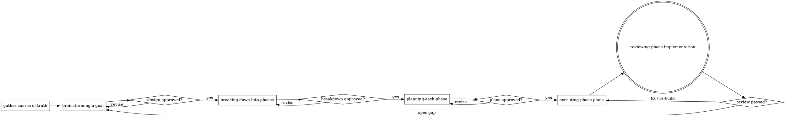

# Planning Work in Phases

## Overview

Router for the planning workflow. One job: take a goal from whatever source exists,
then drive it through the phases in order — **brainstorm → breakdown into phases →
one plan per phase → execute the plans → review the implementation** — handing off to the
matching phase skill at each step. Do not do the phase work here — gather, check, route, gate.

Each phase is its own delegatable skill. Between phases there is a **user approval
gate** — but **how many gates fire is set by the complexity tier** (Step 0.5): a Small/autonomous
run collapses to a single end gate, a Large run keeps every gate. Classify the tier before routing.

## When to Use

- "Plan this feature / epic", "break this down", "let's scope this out before building".
- Starting from a Jira / Linear ticket, a PRD, a plan doc, a brainstorm, or just a link.
- Before entering plan mode or writing code for a multi-step task.

Not for: a single trivial edit, or work already broken down with an approved plan in
hand (jump straight to execution).

## Step 0 — Gather the source of truth

Read every intent artifact available: the prompt, attached docs, spec, PRD, brainstorm
notes, plan doc. If given **only a link** (Jira / Linear / PRD / doc), pull its content:

- `WebFetch` the URL, or use an available Atlassian / Linear MCP (search deferred tools
  with `ToolSearch` for `jira` / `linear` / `atlassian`) to read the ticket or PRD.
- If it is unreachable (auth, private), ask the user to paste the content. Do not guess
  what a ticket says.

Extract: goal, scope, intended stack, constraints, success metrics, what "done" means.

**If the goal is a bug / incident / regression without a known root cause**, don't plan a fix
blind — **REQUIRED SUB-SKILL:** run `debugging-an-issue` first. It produces a committed diagnosis
doc (root cause + resolution approach + regression-test plan) that becomes the source of truth for
the phases below.

**If the goal is a security concern / audit**, **REQUIRED SUB-SKILL:** run
`finding-security-vulnerabilities` first. It produces a committed assessment doc (confirmed findings
+ remediation approach + security-test plan) that becomes the source of truth for the phases below.

## Superpowers check

The phase skills delegate to the `superpowers` plugin when it is present. Detect it once
here and note the result for the phases:

```bash
# installed on disk? (version-agnostic)
ls ~/.claude/plugins/cache/*/superpowers/*/skills/brainstorming/SKILL.md 2>/dev/null
# enabled?
grep -q '"superpowers@claude-plugins-official": true' ~/.claude/settings.json && echo enabled
```

Or run `claude plugin list`. `brainstorming` backs phase 1, `writing-plans` backs phase 3.
Each phase re-checks lightly (it can be invoked directly), so this is just a heads-up.

## The phases



Route in order — each is a mandatory hand-off, not optional:

1. Brainstorm → **REQUIRED SUB-SKILL:** use `brainstorming-a-goal`. Gate on the user
   approving the design doc.
2. Breakdown → **REQUIRED SUB-SKILL:** use `breaking-down-into-phases`. Gate on the user
   approving the breakdown.
3. Plan → **REQUIRED SUB-SKILL:** use `planning-each-phase`. Produces one plan per phase.
4. Execute → **REQUIRED SUB-SKILL:** use `executing-phase-plans`. Runs the plans one per
   phase in dependency order (worktree + subagent-or-inline choices made there).
5. Review → **REQUIRED SUB-SKILL:** use `reviewing-phase-implementation`. Agent review then
   user review (or fully autonomous) against the spec + plan; on approval marks the plan done
   and stamps progress. A spec gap here loops back to phase 1.

## Step 0.5 — Classify the complexity tier

**Before routing, size the goal and set its tier.** The tier is the workflow's throttle: it
scales ceremony to the actual work so a small feature doesn't pay large-feature overhead. State
the tier and its reasoning to the user, then carry it through every phase (record it in the design
doc header so the phase skills read it). **Every phase skill reads this tier and adjusts** — it is
not advisory.

Default heavy ceremony is the single biggest reason a small feature takes hours. Right-sizing here
is the highest-leverage step in the workflow.

| Tier | Trigger | Phases | Execution | Review cadence | Phase-5 gate | Approval gates |
|---|---|---|---|---|---|---|
| **Trivial** | 1 file, no new interface, obvious change | 0 — skip the workflow, just do it | inline | self-verify + `/code-review` | none formal | none — do + report |
| **Small** | one feature, ≲8 tasks, one subsystem, low risk (e.g. a CRUD quiz list) | **1** | **inline** | **per-phase** (one review at the end) | code + QA once; **security only if risk-flagged**; E2E once | **single end gate** |
| **Standard** | multi-subsystem or moderate risk | 2–3 | subagent **or** inline | per-phase | full gate; E2E at end | milestone (after backend / after frontend) |
| **Large** | many subsystems, high risk, or a contract-split parallel build | N | subagent-driven | **per-task** | full gate **per phase**; security every phase | per-phase |

**Risk flag (overrides size upward).** If the change touches **auth, crypto, payments, PII, file
uploads, or untrusted external input**, force the security pass and a heavier gate regardless of
size — a Small quiz with **grading/submission** logic is risk-flagged (gets security + tighter
review); a quiz **list/browse** CRUD is not. When unsure whether a tier fits, **ask the user** —
don't silently pick heavy or light.

**Ceremony that never scales away, any tier:** every goal gets a design doc (short is fine) and one
approval; the **≥95% coverage gate** (per-file changed + global ratchet); **security on any
risk-flagged change**; an **E2E** proving user-visible behavior before done; spec↔code
traceability. Tiers remove *redundant repetition and forced serialization*, never the quality bar.

## Approval gates

Between phases there is normally a user approval gate (design → breakdown → plans → build →
review). **The tier sets how many gates actually fire:**

- **Single end gate** (Small tier, or any run the user marks autonomous): approve the **design doc
  once**, then the workflow runs breakdown → plan → execute → review straight through to **one
  review gate at the end**. No pause between phases.
- **Milestone gates** (Standard): pause at meaningful milestones (backend done, frontend done), not
  every phase.
- **Per-phase gates** (Large, or human-in-the-loop by request): the full gate between every phase.

Never collapse the **final** review gate — a build is not done until its phase-5 review passes,
whatever the tier.

## Convention this workflow enforces

- **Artifact home:** `docs/plan/` — `specs/` (design docs), `breakdown/` (phase breakdowns),
  `phases/<N-slug>/plan.md` (one plan per phase). Same layout whether or not superpowers is
  installed.
- **Delegate when present, inline when absent:** phases 1 and 3 use the superpowers skill if
  available; otherwise they ask the user to install it or continue with a faithful inline
  fallback.
- **Tier-gated approvals:** the complexity tier (Step 0.5) sets how many inter-phase gates fire —
  single end gate for Small/autonomous, per-phase for Large. The **final** phase-5 review gate is
  never skipped at any tier.
