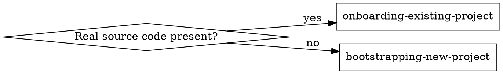

# Setting Up Claude in a Project

## Overview

Router for the initial Claude Code setup phase: decide **new** vs **existing** project, then
hand off to the matching workflow skill.

Grounded in Anthropic's official large-codebase guidance:
https://claude.com/blog/how-claude-code-works-in-large-codebases-best-practices-and-where-to-start

## When to Use

- First-time Claude Code setup ("init this project", "set up Claude here").
- Unsure whether the project is greenfield or established.
- Before touching `CLAUDE.md` / `AGENTS.md` for setup purposes.

Not for routine feature work in an already-onboarded repo.

## The one decision

**"Real source code" = beyond docs/config scaffolding:** source files, a package manifest
(`package.json`, `pyproject.toml`, `go.mod`, `Cargo.toml`, …), a populated `src`/`lib`/`app`
tree, migrations, tests.

- **Existing** — real source present (even if messy or undocumented).
- **New** — empty repo, or only specs/PRD/plan/README/`docs/`, no source yet.

Check fast: `git ls-files | head`, or grep for a manifest. A `README` + PRD with no code is
**new**; a manifest with empty `src/` is **existing**.

## Route

- Existing project → **REQUIRED SUB-SKILL:** `onboarding-existing-project`.
- New project → **REQUIRED SUB-SKILL:** `bootstrapping-new-project`.

Genuinely ambiguous → ask: "Source code to build on, or starting from a spec/plan?"

## Convention this setup enforces

`CLAUDE.md` is **canonical**; `AGENTS.md` is a **symlink** to it (`ln -s CLAUDE.md AGENTS.md`).
Both sub-skills do **not** create a project-memory store (`MEMORY.md` / `.claude/memory/`) —
setup scopes to docs and workflow wiring (hooks / MCP / plugins).

**Invariant — never overwrite an existing `CLAUDE.md`.** Create only when absent; if one exists,
propose changes (`.claude/setup-analysis.md`) or a git-ignored `CLAUDE.local.md` instead.

Both paths also confirm:
- **Hooks** (SessionStart context, PostToolUse format, Stop doc-sync) — active automatically once
  enabled, format hook auto-detects the formatter (`CLAUDE.md` `## Hooks`).
- **MCP servers**: keyless `context7` + `playwright` + `shadcn` load automatically; optional auth
  servers (`figma`/`sentry`/`github`) are opt-in via `install.sh` (`## MCP servers`).
- Optional **companions**: `bash scripts/install-plugins.sh` adds `superpowers` + `ponytail` and
  the `rtk` CLI/hook, all optional (`## Plugins & external tooling`).
</content>
